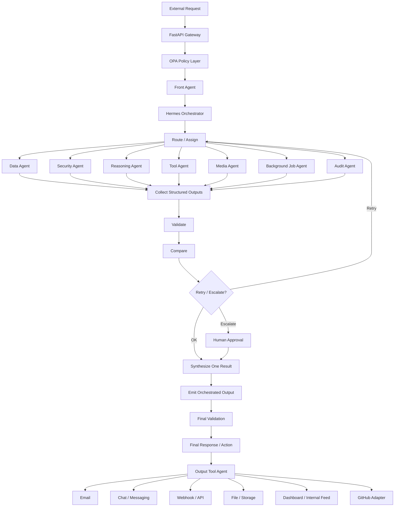

# Latest Mermaid Flow

```mermaid
flowchart TD
    A[External Request] --> B[FastAPI Gateway]
    B --> C[OPA Policy Layer]
    C --> D[Front Agent]
    D --> E[Hermes Orchestrator]
    E --> F[Route / Assign]

    F --> G[Data Agent]
    F --> H[Security Agent]
    F --> I[Reasoning Agent]
    F --> J[Tool Agent]
    F --> K[Media Agent]
    F --> L[Background Job Agent]
    F --> M[Audit Agent]

    G --> N[Collect Structured Outputs]
    H --> N
    I --> N
    J --> N
    K --> N
    L --> N
    M --> N

    N --> O[Validate]
    O --> P[Compare]
    P --> Q{Retry / Escalate?}
    Q -->|Retry| F
    Q -->|Escalate| R[Human Approval]
    Q -->|OK| S[Synthesize One Result]
    R --> S

    S --> T[Emit Orchestrated Output]
    T --> U[Final Validation]
    U --> V[Final Response / Action]
    V --> W[Output Tool Agent]

    W --> X[Email]
    W --> Y[Chat / Messaging]
    W --> Z[Webhook / API]
    W --> AA[File / Storage]
    W --> AB[Dashboard / Internal Feed]
    W --> AC[GitHub Adapter]
```
