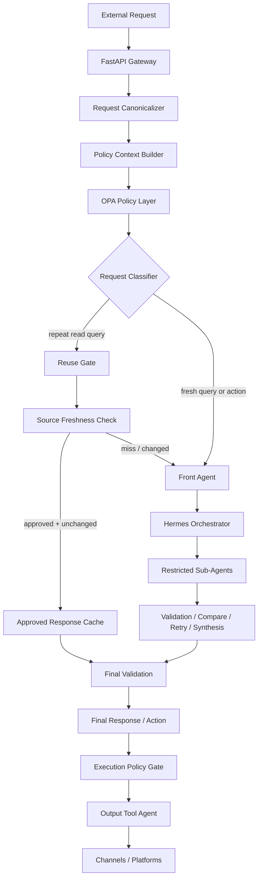

# Latest Mermaid Flow v2

```mermaid
flowchart TD
    ER["External Request"] --> FG["FastAPI Gateway"]
    FG --> RC["Request Canonicalizer"]
    RC --> PCB["Policy Context Builder"]
    PCB --> OPA["OPA Policy Layer"]
    OPA --> RCL{"Request Classifier"}

    RCL -->|"repeat read query"| RG["Reuse Gate"]
    RG --> SFC["Source Freshness Check"]
    SFC -->|"approved + unchanged"| ARC["Approved Response Cache"]
    SFC -->|"miss / changed"| FA["Front Agent"]
    ARC --> FVAL["Final Validation"]

    RCL -->|"fresh query or action"| FA
    FA --> HO["Hermes Orchestrator"]
    HO --> SUB["Restricted Sub-Agents"]
    SUB --> SYN["Validation / Compare / Retry / Synthesis"]
    SYN --> FVAL
    FVAL --> FRA["Final Response / Action"]
    FRA --> EPG["Execution Policy Gate"]
    EPG --> OTA["Output Tool Agent"]
    OTA --> CH["Channels / Platforms"]
```
