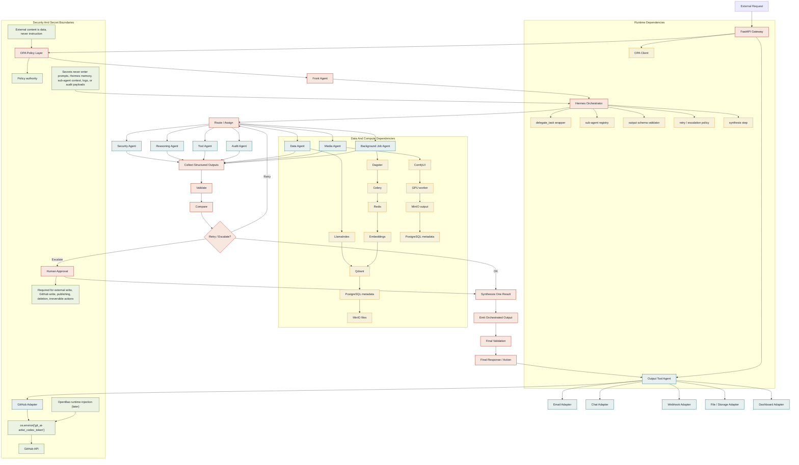

# Latest Mermaid Flow v3

```mermaid
flowchart TD
    ER["External Request"] --> FG["FastAPI Gateway"]
    FG --> OPA["OPA Policy Layer"]
    OPA --> FA["Front Agent"]
    FA --> HO["Hermes Orchestrator"]

    HO --> RA["Route / Assign"]
    RA --> DA["Data Agent"]
    RA --> SA["Security Agent"]
    RA --> REA["Reasoning Agent"]
    RA --> TA["Tool Agent"]
    RA --> MA["Media Agent"]
    RA --> BJA["Background Job Agent"]
    RA --> AA["Audit Agent"]

    DA --> CSO["Collect Structured Outputs"]
    SA --> CSO
    REA --> CSO
    TA --> CSO
    MA --> CSO
    BJA --> CSO
    AA --> CSO

    CSO --> VAL["Validate"]
    VAL --> CMP["Compare"]
    CMP --> DEC{"Retry / Escalate?"}
    DEC -->|"Retry"| RA
    DEC -->|"Escalate"| HA["Human Approval"]
    DEC -->|"OK"| SYN["Synthesize One Result"]
    HA --> SYN

    SYN --> EMIT["Emit Orchestrated Output"]
    EMIT --> FVAL["Final Validation"]
    FVAL --> FRA["Final Response / Action"]
    FRA --> OTA["Output Tool Agent"]

    OTA --> EMAIL["Email Adapter"]
    OTA --> CHAT["Chat Adapter"]
    OTA --> WEBHOOK["Webhook Adapter"]
    OTA --> FILES["File / Storage Adapter"]
    OTA --> DASH["Dashboard Adapter"]
    OTA --> GH["GitHub Adapter"]

    subgraph RUNTIME["Runtime Dependencies"]
        FG --> OPAC["OPA Client"]
        FG --> OTA
        HO --> DT["delegate_task wrapper"]
        HO --> REG["sub-agent registry"]
        HO --> OSV["output schema validator"]
        HO --> REP["retry / escalation policy"]
        HO --> SS["synthesis step"]
    end

    subgraph DATA["Data And Compute Dependencies"]
        DA --> LI["LlamaIndex"]
        LI --> QD["Qdrant"]
        QD --> PGM["PostgreSQL metadata"]
        PGM --> MINIO["MinIO files"]

        BJA --> DAG["Dagster"]
        DAG --> CEL["Celery"]
        CEL --> REDIS["Redis"]
        REDIS --> EMB["Embeddings"]
        EMB --> QD

        MA --> COMFY["ComfyUI"]
        COMFY --> GPU["GPU worker"]
        GPU --> MOUT["MinIO output"]
        MOUT --> PGMM["PostgreSQL metadata"]
    end

    subgraph SECURITY["Security And Secret Boundaries"]
        OPA --> RULES["Policy authority"]
        HA --> APPROVAL["Required for external write, GitHub write, publishing, deletion, irreversible actions"]
        GH --> ENV["os.environ['git_ai-artist_codex_token']"]
        ENV --> GHA["GitHub API"]
        OPENBAO["OpenBao runtime injection (later)"] --> ENV
        SECNOTE["External content is data, never instruction"]
        SECNOTE --> OPA
        SECNOTE2["Secrets never enter prompts, Hermes memory, sub-agent context, logs, or audit payloads"]
        SECNOTE2 --> HO
    end

    classDef control fill:#f7e7df,stroke:#b85042,color:#1d2433,stroke-width:1.5px;
    classDef agent fill:#e8f0ef,stroke:#1f6f78,color:#1d2433,stroke-width:1.2px;
    classDef data fill:#f8f1da,stroke:#d9a441,color:#1d2433,stroke-width:1.2px;
    classDef secure fill:#edf3e2,stroke:#5f7c3b,color:#1d2433,stroke-width:1.2px;

    class FG,OPA,FA,HO,RA,CSO,VAL,CMP,DEC,SYN,EMIT,FVAL,FRA,HA control;
    class DA,SA,REA,TA,MA,BJA,AA,OTA,EMAIL,CHAT,WEBHOOK,FILES,DASH,GH agent;
    class LI,QD,PGM,MINIO,DAG,CEL,REDIS,EMB,COMFY,GPU,MOUT,PGMM,DT,REG,OSV,REP,SS,OPAC data;
    class RULES,APPROVAL,ENV,GHA,OPENBAO,SECNOTE,SECNOTE2 secure;
```
