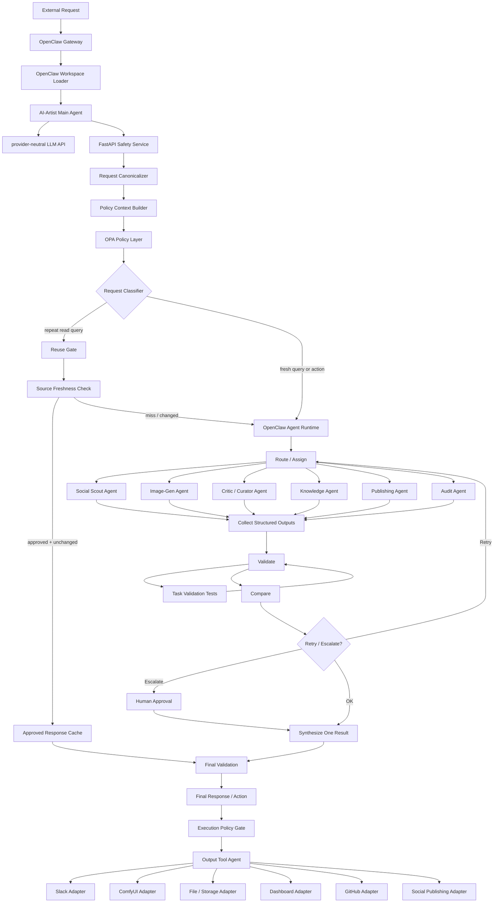

# Latest Mermaid Flow v3

```mermaid
flowchart TD
    ER["External Request"] --> OCG["OpenClaw Gateway"]
    OCG --> WS["OpenClaw Workspace Loader"]
    WS --> MAIN["AI-Artist Main Agent"]
    MAIN --> HLLM["provider-neutral LLM API"]
    MAIN --> FSS["FastAPI Safety Service"]
    FSS --> RC["Request Canonicalizer"]
    RC --> PCB["Policy Context Builder"]
    PCB --> OPA["OPA Policy Layer"]
    OPA --> RCL{"Request Classifier"}

    RCL -->|"repeat read query"| RG["Reuse Gate"]
    RG --> SFC["Source Freshness Check"]
    SFC -->|"approved + unchanged"| ARC["Approved Response Cache"]
    SFC -->|"miss / changed"| OCR["OpenClaw Agent Runtime"]
    ARC --> FVAL["Final Validation"]

    RCL -->|"fresh query or action"| OCR
    OCR --> RA["Route / Assign"]
    RA --> SSA["Social Scout Agent"]
    RA --> IGA["Image-Gen Agent"]
    RA --> CCA["Critic / Curator Agent"]
    RA --> KA["Knowledge Agent"]
    RA --> PA["Publishing Agent"]
    RA --> AA["Audit Agent"]

    SSA --> CSO["Collect Structured Outputs"]
    IGA --> CSO
    CCA --> CSO
    KA --> CSO
    PA --> CSO
    AA --> CSO

    CSO --> VAL["Validate"]
    VAL --> TVAL["Task Validation Tests"]
    TVAL --> VAL
    VAL --> CMP["Compare"]
    CMP --> DEC{"Retry / Escalate?"}
    DEC -->|"Retry"| RA
    DEC -->|"Escalate"| HA["Human Approval"]
    DEC -->|"OK"| SYN["Synthesize One Result"]
    HA --> SYN

    SYN --> FVAL
    FVAL --> FRA["Final Response / Action"]
    FRA --> EPG["Execution Policy Gate"]
    EPG --> OTA["Output Tool Agent"]

    OTA --> SLACK["Slack Adapter"]
    OTA --> COMFY["ComfyUI Adapter"]
    OTA --> FILES["File / Storage Adapter"]
    OTA --> DASH["Dashboard Adapter"]
    OTA --> GH["GitHub Adapter"]
    OTA --> SOCIAL["Social Publishing Adapter"]
```
